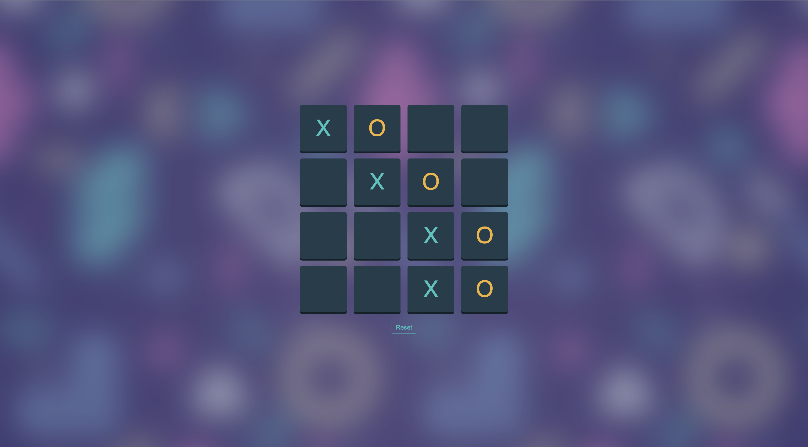

# Tic-Tac-Toe Game

Tic-Tac-No is an advanced version of the classic Tic-Tac-Toe game, featuring options to play against the computer with customizable board size from the source code right now .

## Features

- **Play Against the Computer:** Test your skills by competing against an AI opponent.
- **Customizable Board Size:** Set the number of squares on the board for a more challenging game.

## Technologies Used

- **HTML5**
- **CSS3**
- **JavaScript (ES6+)**

## Getting Started

To get started with the Tic-Tac-No game, simply clone the repository and open the `index.html` file in your browser.

### Prerequisites

- A modern web browser that supports HTML5, CSS3, and JavaScript.

### Installation

1. Clone the repository:
   ```bash
   git clone https://github.com/Mohamed-khaled-mohmamed/tic-tac-toe.git
   ```
2. Navigate to the project directory:
   ```bash
   cd Tic-Tac-Toe
   ```
3. Open `index.html` in your browser to start the game.

## How to Play

1. **Select the Board Size:** Choose the number of squares on the board (e.g., 3x3, 4x4, 5x5).
2. **Select Difficulty Level:** Pick a difficulty level from Easy, Medium, or Hard.
3. **Start the Game:** Click on the squares to place your X or O.
4. **Reset:** Press the "Reset" button to start a new game.

## Screenshot



## License

This project is licensed under the MIT License - see the [LICENSE](LICENSE) file for details.

```
